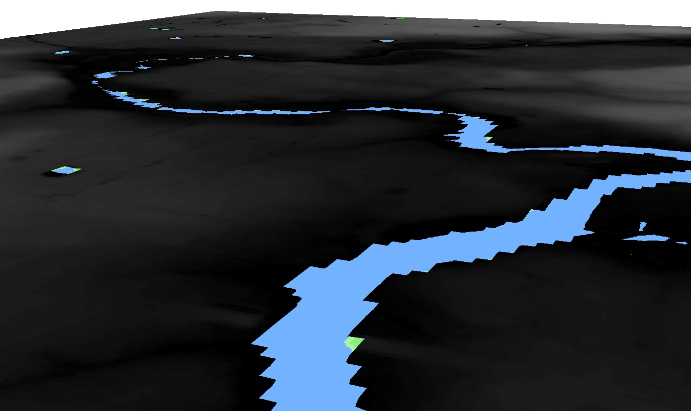
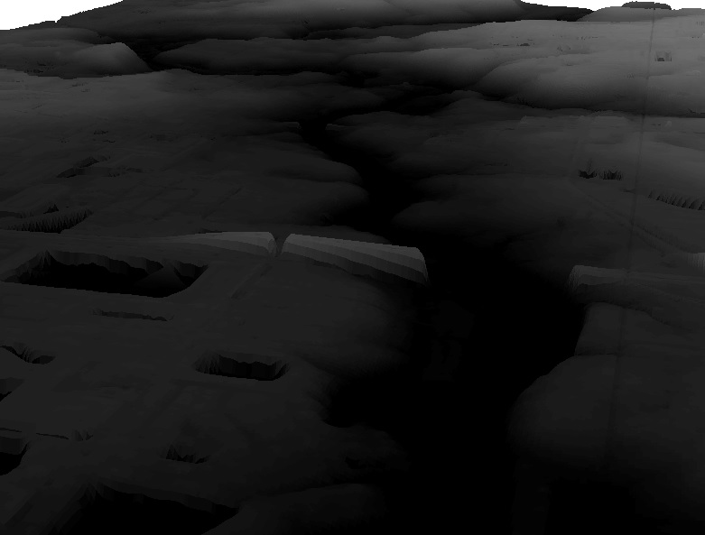
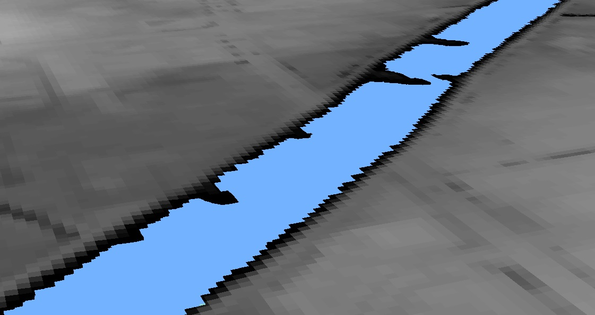
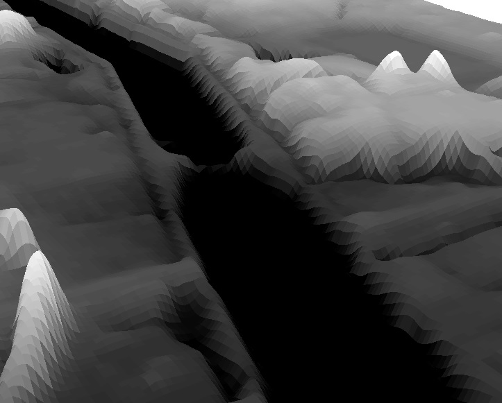
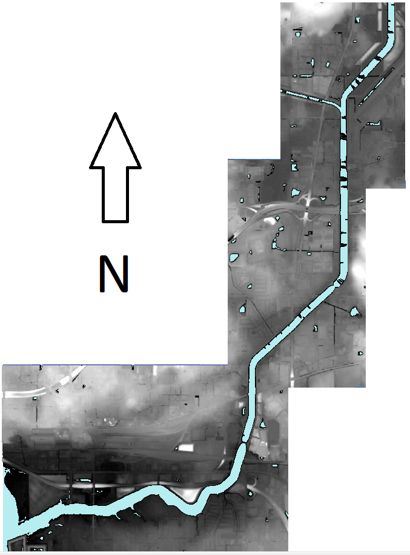
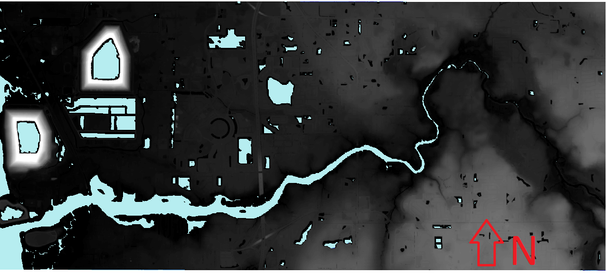

# Canals and Rivers: A comparison
This site uses maps and 3d illustrations to highlight some differences between canals and Rivers. For the sake of example, we explore the Tampa Bypass canal and the Alafia River.  Additionally, the role of remote sensing is explored.

LiDAR point clouds are collections of points.  Each point has a known elevation value. A Digital Elevation Model (DEM) is derived from a collection of these points. Points can be symbolized based on various ideas. Here, they are generally symbolized by elevation.

LiDAR data is collect by airplane overflights.  The images on this site were derrived from LiDAR data that NOAA gathered.

## River banks vs Canal banks

### River Banks
The DEM here is used to show the slope of banks, which may be of interest to flood planning.

Natural rivers may have shallower banks.

This slope is more apparent with the height exagerated 30 times.

### Canal Banks
Canal banks may be steeper, allowing certain land use to be closer in.  In the google map below, note how close Tampa Executive airport and many structures are to the Tampa Bypass canal. 

In this image, note U.S. 301, the line from the bottom right to the top middle.

This slope is more apparent with the height exagerated 30 times.

## Canal Course vs River Course
Here, the DEM is shown twice.  The land area is show by "draping" the DEM over its elevation data; giving it a 3D look.  The river and canal are shown with the lowest elevation (their only visible part) shown in blue.

 

This image shows the course of a canal (created from NOAA DEM)

This map illustrates that rivers may wander considerably. This can impact land use planning. It also creates point bars, peninsula-like features that may present interesting development or conservation opportunities.

Google Maps prove a satellite illustration

### **Tampa Bypass Canal**
<iframe src="https://www.google.com/maps/embed?pb=!1m18!1m12!1m3!1d71473.96014073727!2d-82.39291039551897!3d28.014363912322608!2m3!1f0!2f0!3f0!3m2!1i1024!2i768!4f13.1!3m3!1m2!1s0x88c2c8c2e4570e8d%3A0xe0bbd483daa1a0a0!2sTampa+Bypass+Canal!5e1!3m2!1sen!2sus!4v1487431088248" width="600" height="450" frameborder="0" style="border:0" allowfullscreen></iframe>

### **Alafia River**
<iframe src="https://www.google.com/maps/embed?pb=!1m14!1m12!1m3!1d35804.517096492615!2d-82.34472897814412!3d27.865930239218606!2m3!1f0!2f0!3f0!3m2!1i1024!2i768!4f13.1!5e1!3m2!1sen!2sus!4v1487436346440" width="600" height="450" frameborder="0" style="border:0" allowfullscreen></iframe>

## Elevation
Elevation may vary more near a river than near a canal.
Thanks to elevation information computed from the LiDAR scans, we can show a terrain elevations for every 5 meter x 5 meter cell.  In some data sets, these cells are even smaller. This is one of the more valuable uses of of a remotely sensed DEM.  In these images, red is lower elevation.  Elevation climbs from red through yellows to greens.  _As usual, true North is toward the top of the image_
### Canal Elevation
The elevation near canals is made made. It can also be quite steep, permitting closer-in land use.

### River Elevation
The river has broader areas of lower elevation, which poses more of a flood risk. _This map uses the same legend as the canal map._

## Credits
Images were ArcMap and ARCScene screenshots which depicted default stretch and elevation classification schemes.  The data was from National Oceanicogrpahic & Atmospheric Administration's Sea Level Rise Digital Elevation model of the Tampa Bay area. This data is the "NOAA Sea Level Rise Viewer DEM" and can be found at https://coast.noaa.gov/dataviewer/#/lidar/search/-9178176.171342539,3229235.1339638405,-9157385.29964897,3253771.4200433823 
